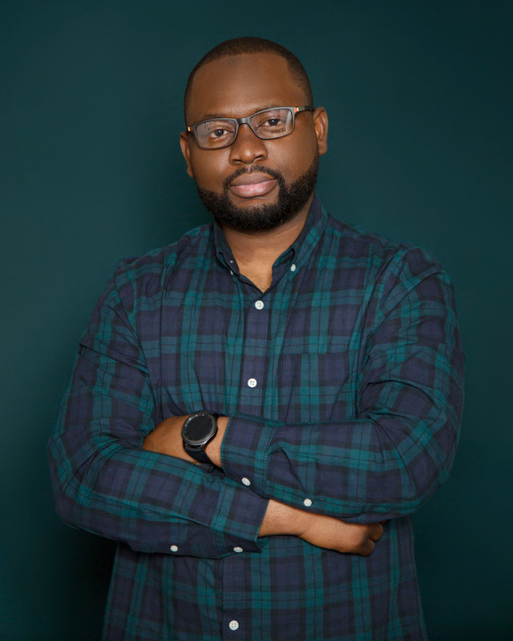
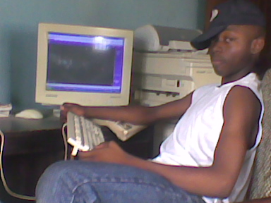

## Portrait
  

## About Me  
Kabir Abdulmajeed is a Data Science Consultant with the Boston Consulting Group. He worked as a Data Scientist building data-driven solutions with and for some of the biggest Oil and Gas companies such as ROSEN and Saudi Aramco. Most recently, he led the next-gen development of machine learning algorithms for detecting and sizing corrosion in pipelines. He also has experience working in the telecommunications industry as a 3G Engineer with Alcatel-Lucent/Nokia and had a short stint as a Doctoral Researcher working on Autonomous Robotics. Kabir holds a first-class B.Eng. in Electrical Engineering from Osun State University, graduating with 4 major awards including the Pro-Chancellor’s Award of Excellence. He completed his first M.Sc. in Systems Engineering and his second M.Sc. in Computer Science specializing in Machine Learning from Georgia Institute of Technology. He enjoys reading technical subjects, playing video games, and likes to play football (soccer).
  
First programming language: **`QBasic`** back in 2006!  
>  
  

## My Resume (2021)  

 
  CV/Resume : <a href="NA"> View/Download PDF</a> 

## Others    
  
  
